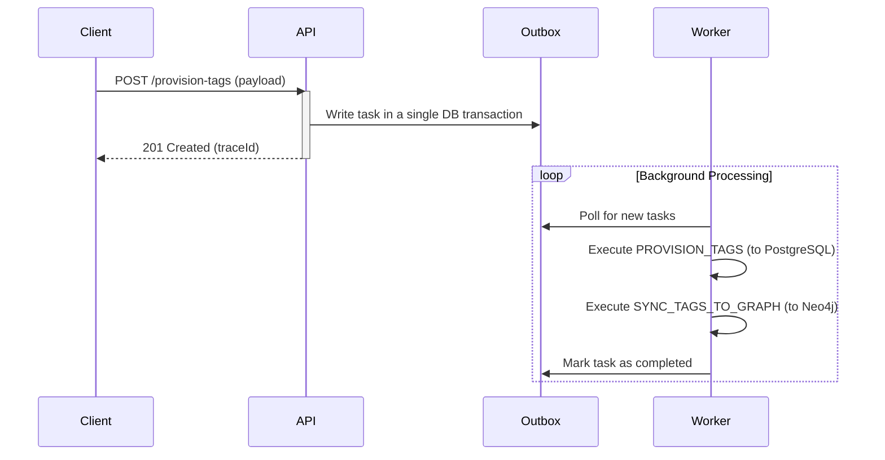

# 實體標籤預置工作流程 (Entity Tag Provisioning Workflow)

## 功能概述

此模組專責一個非同步的標籤預置 (Tag Provisioning) 工作流程。其核心目標是在一個包含多種資料庫（關聯式與圖）的系統中，以一種低延遲、高可靠且可觀測的方式，建立並同步標籤 (Tags) 與標籤群組 (Tag Groups) 的分類體系。

## 架構理念

### 為什麼需要非同步工作流程？

標籤資料同時存在於兩個儲存層：
1.  **PostgreSQL**: 作為主資料來源 (Source of Truth)，儲存權威的標籤紀錄。
2.  **Neo4j**: 作為圖資料庫，用於高效的關聯查詢與分析（最終一致性）。

如果讓 API 請求同步等待兩個資料庫都寫入完成，會引發一系列問題：
- **高延遲**: API 回應變慢，系統吞吐量下降。
- **低可靠**: 任何一個資料庫的短暫不穩定都會導致 API 請求失敗。
- **補償困難**: 當 PostgreSQL 寫入成功但 Neo4j 寫入失敗時，資料處於部分成功的狀態，難以追蹤與修復。

本模組採用的非同步方案，將工作拆解為可獨立執行的單元：
- **快速回應**: API 接收到請求後，僅需將任務寫入 Outbox，即可快速回應 `201 Created` 並附帶一個 `traceId`。
- **背景處理**: 背景的 Worker 服務會從 Outbox 中提取任務，依序執行 `PROVISION_TAGS` 和 `SYNC_TAGS_TO_GRAPH` 兩個步驟。
- **獨立重試**: 如果 `SYNC_TAGS_TO_GRAPH` 步驟失敗（例如 Neo4j 暫時不可用），Worker 可以安全地單獨重試此步驟，而不會影響已經成功寫入 PostgreSQL 的資料。

### 兩階段提交與 Outbox Pattern



**Outbox Pattern 的價值** 在於它解決了分散式系統中「至少執行一次 (at-least-once)」語義下的任務遺失問題。即使在 API 成功回應後、Worker 處理前，系統發生崩潰，任務仍然安全地保存在資料庫的 Outbox 表中，待系統恢復後即可繼續處理。

## 檔案結構解析

```text
tag-provisioning/
├── index.ts                  # 模組進入點：向核心 WorkflowRegistry 註冊狀態機，並 side-effect import processors
├── README.md                 # (本檔案) 模組設計說明
├── contract.ts               # 定義穩定的 Action 常數、Event Code 與 Workflow 名稱
├── api/
│   ├── route.ts              # OpenAPI 路由定義（路徑、請求/回應 Schema）
│   ├── handler.ts            # HTTP 請求處理器：寫入 Outbox + WorkflowState，觸發背景任務
│   └── schema.ts             # API 回應 Schema（引用 shared ResponseSchema）
├── core/
│   └── processors.ts         # 實現每個 Action 的業務邏輯（PROVISION_TAGS、SYNC_TAGS_TO_GRAPH）
│                             # 也定義 EntityCreateInputSchema 供 route 使用
└── machine/
    ├── machine.ts            # XState 狀態機定義（狀態轉移、guard、actions）
    ├── logic.ts              # 狀態機 action 的具體實作（handleSaveSuccess, handleFailure）
    └── schema.ts             # 狀態機 context 與 event 的 Zod Schema 與 TypeScript 類型
```

## 契約邊界 (Contract Boundaries)

### 外部 API 契約 (`api/schema.ts` & `api/route.ts`)

定義 HTTP 端點的請求與回應格式，暴露給外部客戶端：

- **`EntityCreateInputSchema`** (定義於 `core/processors.ts`，供 route 引用): API 的輸入，接受單一或批次的實體建立請求。
- **`EntityCreateResponseSchema`** (定義於 `api/schema.ts`): API 的輸出，遵循 shared `ResponseSchema` 信封格式，包含 `traceId`。

### 內部工作流程契約 (`machine/schema.ts` & `core/processors.ts`)

這些 Zod Schema 定義了工作流程內部各個處理器 (Processor) 之間的資料契約：

- **`EntityCreateInputSchema`** (位於 `core/processors.ts`): `PROVISION_TAGS` 處理器的輸入，單一或批次的實體描述。
- **`EntityTagSyncPayloadSchema`** (位於 `core/processors.ts`): `SYNC_TAGS_TO_GRAPH` 處理器的輸入，即上一步 PostgreSQL 建立後回傳的 `{ id, name }` 陣列。
- **`MachineContextSchema`** (位於 `machine/schema.ts`): 狀態機的持久化 context，包含 `entityList`（作為步驟間的中間結果傳遞）與 `nextTask`（待執行的下一個背景任務）。

將內部契約與外部 API 契約分離，使我們可以在不破壞外部客戶端的情況下，自由地演進內部實現。

## 狀態機語義

狀態轉移圖：

```text
SAVING_ENTITY ─[TAG_PROVISION_SUCCESS]──→ SYNCING_ENTITY ─[TAG_SYNC_TO_GRAPH_SUCCESS]──→ SUCCESS
      ↓                                           ↓
      └─[TAG_PROVISION_FAILURE]──→ FAILED         └─[TAG_SYNC_TO_GRAPH_FAILURE]──→ FAILED
```

XState 狀態定義對應：

| 狀態             | 意義                                         |
|------------------|----------------------------------------------|
| `SAVING_ENTITY`  | 等待 `PROVISION_TAGS` 處理器完成 PostgreSQL 寫入 |
| `SYNCING_ENTITY` | 等待 `SYNC_TAGS_TO_GRAPH` 處理器完成 Neo4j 同步 |
| `SUCCESS`        | 兩個步驟均成功，終態                         |
| `FAILED`         | 任一步驟失敗，終態，錯誤詳情記錄於 context.error |

- **冪等設計**: 每個處理器都設計為冪等的。`PROVISION_TAGS` 使用 `upsert`，`SYNC_TAGS_TO_GRAPH` 使用 `MERGE`，確保重複執行不會產生副作用。
- **失敗隔離**: PostgreSQL 的預置失敗會直接使整個流程終止於 `FAILED` 狀態。而 Neo4j 的同步失敗則允許流程在未來被重試，僅重試同步這一步。

## API 語義

- API 回應 `201 Created` 僅代表「**任務已受理並排入佇列**」，不代表標籤已同步至 Neo4j。
- 呼叫端應保存 `traceId`，並通過一個獨立的查詢端點（未在此模組中定義）來查詢工作流程的最終狀態。

## 內部契約細節

### `PROVISION_TAGS`

- **輸入 (`EntityCreateInputSchema`)**: 單一 `{ name, description?, metadata? }` 或陣列
- **輸出**: Prisma `createMany` 的結果（已寫入的 Entity 記錄，通過 `EntityModelSchema` 解析後存入 machine context）

### `SYNC_TAGS_TO_GRAPH`

- **輸入 (`EntityTagSyncPayloadSchema`)**: `[{ id: "uuid", name: "Product" }, ...]`（由 machine context 的 `entityList` 攜帶）
- **處理邏輯**:
    1.  使用 `UNWIND` 展開輸入陣列，對每個實體執行 `MERGE` 確保 `Entity` 節點存在。
    2.  Cypher 的 `MERGE` 語義保證此操作冪等，重複執行不會建立重複節點。
- **輸出**: `{ synced: <count> }`

## 失敗恢復與擴展

- **恢復**: 由於步驟分離且冪等，失敗恢復通常只需要重新觸發失敗的 Worker 任務即可。
- **擴展**: 若要在標籤預置後增加新步驟（例如，更新快取、發送通知），只需：
    1. 在 `contract.ts` 新增 Action。
    2. 在 `machine/machine.ts` 新增對應的狀態與轉移。
    3. 在 `machine/logic.ts` 實作對應的 machine action（如有需要）。
    4. 在 `core/processors.ts` 註冊新 Action 的處理器。

這種模式遵循**垂直切片架構 (Vertical Slice Architecture)**，將相關的邏輯變更限制在單一模組內，極大地降低了系統的複雜性和模組間的耦合。
