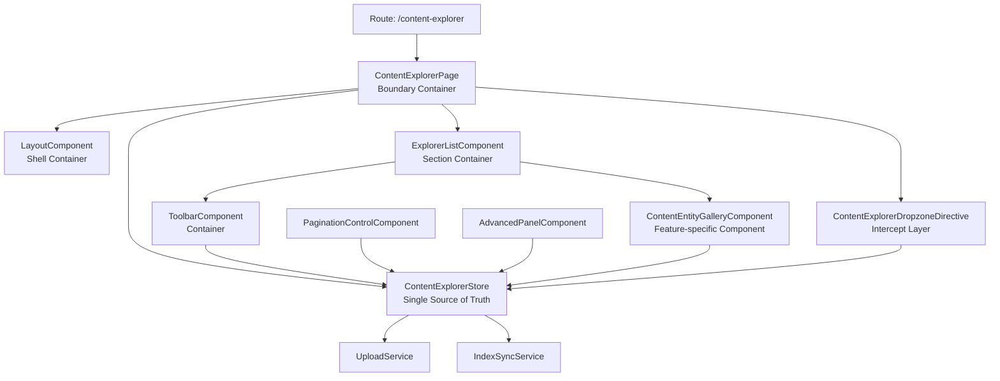

# Content Explorer Slice

本切片採用 Vertical Slice Architecture，`ContentExplorerPage` 是唯一入口與邊界。

## 1. 邊界定義

- 入口元件：`ContentExplorerPage`
- 單一事實來源（SSOT）：`ContentExplorerStore`
- 切片內狀態與互動（搜尋、排序、分頁、拖放）必須先進 Store，再由元件訂閱。

## 2. 依賴方向

允許的依賴方向：

1. `page` -> `containers` / `directives` / `+state`
2. `containers` -> `components` / `+state`
3. `components` -> `+state`（唯讀）

禁止事項：

1. `components` 直接操作 API 或跨 feature service 做業務流程
2. 在 `containers` 或 `components` 內各自建立第二個業務狀態來源
3. 跨切片直接引用非必要 schema 或私有元件

## 3. 結構說明

- `+state/`: 切片狀態、選擇器、狀態轉換
- `containers/`: 組合型元件，負責畫面區塊協作
- `components/`: 展示型/功能型零件，透過 Store 取得資料
- `directives/`: 橫切互動層（如拖放攔截）

## 4. 目前整合策略

1. Toolbar 透過 `TOOLBAR_CONTROLS`（由 `ContentExplorerStore` 提供）送出搜尋/排序/分頁意圖。
2. Entity Gallery 透過 `ContentExplorerStore` 訂閱資料流並使用虛擬捲軸渲染。
3. Drop Zone 透過 `ContentExplorerDropzoneDirective` 攔截 drag/drop，直接更新 Store 的 `isDragging` 與上傳流程。

## 5. 擴充規則

新增功能時，請依序判斷：

1. 是否改變切片狀態？若是，先加在 `ContentExplorerStore`。
2. 是否是共用視覺元件？若是，放到 `shared/ui` 且不含業務邏輯。
3. 是否僅本切片使用？若是，留在 `content-explorer/components`。

## 6. Barrel 匯出

為了降低路徑耦合，優先使用本切片 barrel：

- `content-explorer/index.ts`
- `content-explorer/+state/index.ts`
- `content-explorer/containers/*/index.ts`
- `content-explorer/components/*/index.ts`
- `content-explorer/directives/index.ts`

## 7. 容器架構圖



## 8. 舞台面板化設計

採用「舞台控制」概念，將複雜一頁式應用分解為明確的「面板」層次，解決狀態爆炸與視覺鬆散的問題。

### 8.1 佈局結構

```
ContentExplorerPage (舞台管理者)
├─ <main> [flex-1 min-h-0 overflow-hidden flex flex-col]
│  └─ ExplorerListComponent
│     ├─ <Toolbar> [shrink-0 border-b]
│     │  └─ p-toolbar (Search / Sort / Pagination Controls)
│     └─ <Gallery> [flex-1 min-h-0 overflow-auto]
│        └─ ContentEntityGalleryComponent (虛擬捲軸)
│
├─ Overlay Layer 1: Dropzone Indicator
│  └─ [absolute inset-0] (活動時全螢幕覆蓋)
│
└─ Overlay Layer 2: Upload Progress
   └─ [fixed right-6 top-[90px]] (右上角浮窗)
```

### 8.2 層次說明

| 層次 | 角色 | CSS 策略 | 行為 |
|-----|------|--------|------|
| **Main Stage** | Toolbar + Gallery 的容器 | `overflow-hidden flex flex-col` | 控制單一捲軸點 |
| **Toolbar Panel** | 搜尋、排序、分頁控制 | `shrink-0 border-b` | 粘在頂部，不隨內容捲動 |
| **Gallery Panel** | 虛擬捲軸內容主舞台 | `flex-1 min-h-0 overflow-auto` | 佔據剩餘空間，內部捲動 |
| **Dropzone Overlay** | 拖拉提示層 | `absolute inset-0 z-40` | 平時隱藏，`isDragging=true` 時全螢幕出現 |
| **Upload Overlay** | 上傳進度指示 | `fixed right-6 top-[90px] z-50` | 平時隱藏，上傳時浮窗顯示 |

### 8.3 Flex Grid 關鍵模式

```css
/* Main Stage: 分隔頂部固定 + 中間可滾 */
<main class="flex-1 min-h-0 overflow-hidden flex flex-col">
  <div class="shrink-0">Toolbar</div>
  <div class="flex-1 min-h-0 overflow-auto">Gallery</div>
</main>

/* 核心原則 */
✓ flex-1 = 佔據可用空間（auto-grow）
✓ min-h-0 = 允許 flex child 低於自然內容高度（Flex 預設值是 auto）
✓ overflow-hidden + 內部 overflow-auto = 單一捲軸點
```

### 8.4 狀態流動

```
1. 使用者操作
   ↓
2. Toolbar / Dropzone 發送事件 → Store.updateState()
   ↓
3. Store 的 signal 改變 (search, sort, isDragging)
   ↓
4. Gallery 訂閱 store.visibleEntries() 自動重算虛擬捲軸
   ↓
5. CDK VirtualScroll 增量渲染新的 DOM 節點
```

### 8.5 效能關鍵點

- **Toolbar 不重算**: 即使搜尋改變，Toolbar 本身不含資料邏輯，只讀取 Store 配置
- **Gallery 增量渲染**: 虛擬捲軸只渲染可見區域（~10-20 項），不管 10000 項也流暢
- **Overlay 平時 hidden**: Dropzone 和 Upload 進度不佔 DOM 流程（`*ngIf`），減少樹深度

## 9. Entity-Gallery 卡片樣式整合

### 9.1 視覺設計轉換

ContentEntityGalleryComponent 已升級為 **Entity Gallery 精緻卡片佈局**，取代原有的列表視圖。

#### 核心特性：

| 特性 | 實現 |
|-----|------|
| **網格佈局** | `md:grid-cols-2 lg:grid-cols-4` (響應式) |
| **懸停效果** | 標題/元數據平移 + 卡片縮放 + 圖標變色 |
| **顏色漸層** | 按 Entity Type 動態範漸層 (WORK/SERIES/COLLECTION) |
| **掃描線動畫** | 懸停時循環掃描效果 (`scan-y` 2s) |
| **類型指示** | 卡片右下角旋轉式類型標籤 |
| **元素平移** | 懸停時標題左上移、元數據右下移 (視差效果) |

### 9.2 樣式色盤

```
主背景：#09090b (極深黑)
卡片背景：#18181b (暗灰) 
內容背景：#050505 (極深黑)
強調色：#3bb2bf (青色)
輔助色：#d9a491 (棕色)
文字色：#d8d4d1 (淺灰)
副文本：#606063 (中灰)
```

### 9.3 HTML/CSS 結構

```html
<!-- 卡片容器：固定アスペクト比 340px (md) / 380px (lg) -->
<article class="relative px-3 pb-12 pt-10">
  <!-- 陰影層：縮放變換 -->
  <div class="shadow-[0_16px_48px_rgba(0,0,0,0.55)] group-hover:scale-[0.98]"></div>
  
  <!-- 內容層：條件 padding (hoveredIndex) -->
  <div class="overflow-hidden rounded-lg">
    <!-- 漸層疊加：按 type 選擇顏色 -->
    <div class="bg-[linear-gradient(...)]" [class.scale-110]="hover" [class.rotate-2]="hover"></div>
    
    <!-- SVG 圖標：類型特定 -->
    <svg class="scale-150 text-[#3bb2bf]" *ngIf="hover"></svg>
    
    <!-- 掃描線：hover 時出現 -->
    <div class="animate-[scan-y_2s_linear_infinite]"></div>
  </div>
  
  <!-- 標題：視差平移 (-translate-x-6 -translate-y-2) -->
  <h3 [class.-translate-x-6]="hover" [class.-translate-y-2]="hover">TITLE</h3>
  
  <!-- 元數據：視差平移 (translate-x-4 translate-y-6) -->
  <div [class.translate-x-4]="hover" [class.translate-y-6]="hover">
    <span class="bg-[#d9a491] text-black">TYPE_LABEL</span>
    <span class="text-[#d8d4d1]">SUBTITLE</span>
  </div>
</article>
```

### 9.4 Signal 狀態管理

```typescript
hoveredIndex = signal<number | null>(null);

setHovered(index: number | null): void {
  this.hoveredIndex.set(index);
}

// Template 中使用
[class.opacity-100]="hoveredIndex() === i"
[class.-translate-x-6]="hoveredIndex() === i"
```

### 9.5 向下兼容性

- ✅ 仍使用 `store.visibleEntries()` 訂閱資料
- ✅ 保留 `trackByEntry()` 性能優化
- ✅ 支持所有 IndexEntry 欄位 (name, type, pages, count, id)
- ✅ 自動生成 Subtitle: `PAGES_N` / `ITEMS_N` / `ID_XXXXXX`
- ✅ 移除 Header 以最大化卡片展示空間 (原有 Content_Index_V3 / ENTITY.EXPLORER)

### 9.6 圖片顯示 & 後端整合

卡片支持從後端 IndexEntry 的 `metadata.coverUrl` 映射顯示背景圖片。

#### **後端數據來源**

根據 `mapFileToIndexEntry()` 和 `mapItemToIndexEntry()`：

```typescript
// File 類型：後端自動生成 coverUrl
coverUrl: `/api/v1/files/{fileId}/serve`

// Item 類型：通過 metadata 字段傳遞
metadata: {
  coverUrl: "...",  // 可選，由業務邏輯提供
  ...otherMetadata
}
```

#### **前端提取邏輯**

改進的 `getCoverUrl()` 方法支持三層 fallback：

```typescript
getCoverUrl(entry: IndexEntry): string | undefined {
    // 1. 優先：從 metadata 中直接讀取 coverUrl
    if (entry.metadata?.coverUrl && typeof entry.metadata.coverUrl === 'string') {
        return entry.metadata.coverUrl;
    }
    
    // 2. 備用：若是 FILE_CONTAINER 且無 coverUrl，自動生成
    if (entry.type === 'FILE_CONTAINER' && entry.id) {
        return `/api/v1/files/${entry.id}/serve`;
    }
    
    // 3. Fallback：無圖片，使用 Gradient + Icon Fallback
    return undefined;
}
```

#### **模板緩存優化**

使用 `@let` 變數避免重複呼叫 `getCoverUrl()`：

```html
@let coverUrl = getCoverUrl(entry);


```

#### **圖片層次結構**（Z-stack）

```
Background Image (z-5)      ← 從後端取圖片，opacity-85，hover 時 scale-105
  ↓
Gradient Overlay (z-10)     ← 漸層覆蓋，按 type 選擇顏色，hover 時 scale-110 + rotate-2
  ↓
Icon (z-20)                 ← SVG 圖標，hover 時變色 + 放大 150%
  ↓
Scan Line (z-30)            ← 掃描線動畫（hover 時出現）
```

#### **載入優化**

- ✅ `loading="lazy"`: 延遲載入圖片（只在可見時載入）
- ✅ 快取 `coverUrl` 防止重複方法呼叫
- ✅ 無圖片時自動切換 Gradient + Icon 展示
- ✅ 支持 CORS 與 CDN 路由（`/api/v1/files/{id}/serve`）

#### **調試提示**

若圖片仍未顯示，請檢查：
1. 瀏覽器 Network 標籤：確認 `/api/v1/files/{id}/serve` 回傳 200 狀態
2. IndexEntry 資料：在 Console 檢查 `entry.metadata.coverUrl` 是否存在
3. CORS 政策：確認後端允許跨域圖片請求
